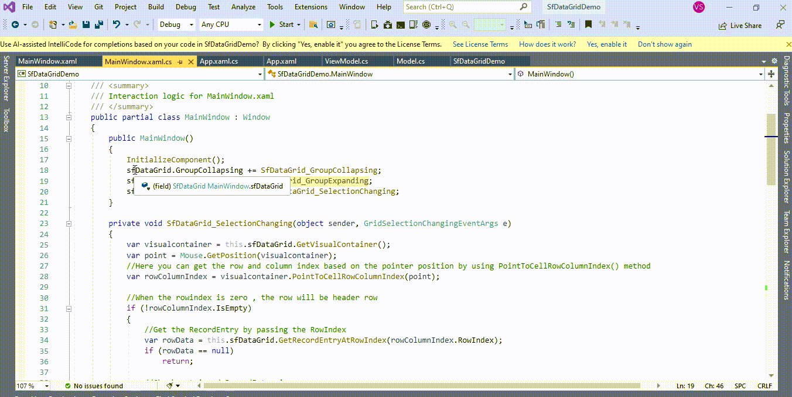

# How to expand the group only when clicking on the expander cell arrow in CaptionSummaryRow in WPF DataGrid (SfDataGrid)? 

## About the sample
This example illustrates how to expand the group only when clicking on the expander cell arrow in CaptionSummaryRow in [WPF DataGrid](https://www.syncfusion.com/wpf-controls/datagrid) (SfDataGrid)? 

[WPF DataGrid](https://www.syncfusion.com/wpf-controls/datagrid) (SfDataGrid) expands the [CaptionSummaryRow](https://help.syncfusion.com/cr/wpf/Syncfusion.UI.Xaml.Grid.SfDataGrid.html#Syncfusion_UI_Xaml_Grid_SfDataGrid_CaptionSummaryRow) when you click anywhere in the [CaptionSummaryRow](https://help.syncfusion.com/cr/wpf/Syncfusion.UI.Xaml.Grid.SfDataGrid.html#Syncfusion_UI_Xaml_Grid_SfDataGrid_CaptionSummaryRow). You can expand the group only when clicking on the [GridExpanderCell](https://help.syncfusion.com/cr/wpf/Syncfusion.UI.Xaml.Grid.GridExpanderCellControl.html) in [CaptionSummaryRow](https://help.syncfusion.com/cr/wpf/Syncfusion.UI.Xaml.Grid.SfDataGrid.html#Syncfusion_UI_Xaml_Grid_SfDataGrid_CaptionSummaryRow) by customization the [GroupExpanding](https://help.syncfusion.com/cr/wpf/Syncfusion.UI.Xaml.Grid.SfDataGrid.html#Syncfusion_UI_Xaml_Grid_SfDataGrid_GroupExpanding), [GroupCollapsing](https://help.syncfusion.com/cr/wpf/Syncfusion.UI.Xaml.Grid.SfDataGrid.html#Syncfusion_UI_Xaml_Grid_SfDataGrid_GroupCollapsing) and [SelectionChanging](https://help.syncfusion.com/cr/wpf/Syncfusion.UI.Xaml.Grid.SfDataGrid.html#Syncfusion_UI_Xaml_Grid_SfDataGrid_SelectionChanging) events in [WPF DataGrid](https://www.syncfusion.com/wpf-controls/datagrid) (SfDataGrid).

```C#

sfDataGrid.GroupExpanding += SfDataGrid_GroupExpanding;
sfDataGrid.GroupCollapsing += SfDataGrid_GroupCollapsing;
sfDataGrid.SelectionChanging += SfDataGrid_SelectionChanging;

private void SfDataGrid_GroupExpanding(object sender, GroupChangingEventArgs e)
{
        var visualcontainer = this.sfDataGrid.GetVisualContainer();
        var point = Mouse.GetPosition(visualcontainer);
        //Here you can get the row and column index based on the pointer position by using PointToCellRowColumnIndex() method
        var rowColumnIndex = visualcontainer.PointToCellRowColumnIndex(point);
        //When the rowindex is zero , the row will be header row 
        if (!rowColumnIndex.IsEmpty)
        {
            if (rowColumnIndex.ColumnIndex > 0)
            {
                e.Cancel = true;
            }
        }
}

private void SfDataGrid_GroupCollapsing(object sender, GroupChangingEventArgs e)
{
        var visualcontainer = this.sfDataGrid.GetVisualContainer();
        var point = Mouse.GetPosition(visualcontainer);
        //Here you can get the row and column index based on the pointer position by using PointToCellRowColumnIndex() method
        var rowColumnIndex = visualcontainer.PointToCellRowColumnIndex(point);
        //When the rowindex is zero , the row will be header row 
        if (!rowColumnIndex.IsEmpty)
        {
            if (rowColumnIndex.ColumnIndex > 0)
            {
                e.Cancel = true;
            }
        }
}

private void SfDataGrid_SelectionChanging(object sender, GridSelectionChangingEventArgs e)
{
        var visualcontainer = this.sfDataGrid.GetVisualContainer();
        var point = Mouse.GetPosition(visualcontainer);
        //Here you can get the row and column index based on the pointer position by using PointToCellRowColumnIndex() method 
        var rowColumnIndex = visualcontainer.PointToCellRowColumnIndex(point);

        //When the rowindex is zero , the row will be header row  
        if (!rowColumnIndex.IsEmpty)
        {
            //Get the RecordEntry by passing the RowIndex 
            var rowData = this.sfDataGrid.GetRecordEntryAtRowIndex(rowColumnIndex.RowIndex);
            if (rowData == null)
               return;

            //Check retrieved RecordEntry is group 
            if (rowData.IsGroups && rowColumnIndex.ColumnIndex > 0)
            {
                e.Cancel = true;
            }
       }
}

```



Take a moment to peruse the [WPF DataGrid – Grouping](https://help.syncfusion.com/wpf/datagrid/grouping) documentation, where you can find about grouping with code examples.

KB article - [How to expand the group only when clicking on the expander cell arrow in CaptionSummaryRow in WPF DataGrid (SfDataGrid)?](https://www.syncfusion.com/kb/12572/how-to-expand-the-group-only-when-clicking-on-the-expander-cell-arrow-in-captionsummaryrow) 

## Requirements to run the demo
Visual Studio 2015 and above versions
